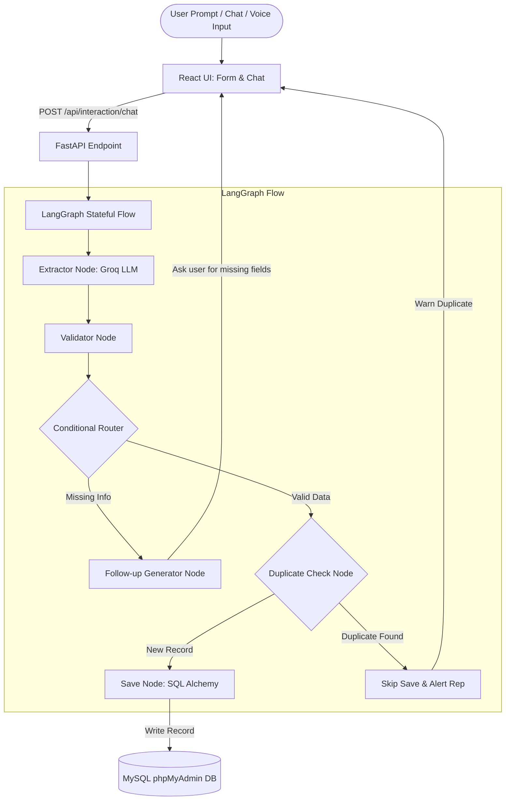

# Pharma CRM - Intelligent HCP Interaction Logging Module

A modular, production-ready full-stack solution to capture, parse, validate, and log interactions with Healthcare Professionals (HCPs) using **FastAPI, LangGraph, React, Redux Toolkit, and MySQL/SQLAlchemy**.

---

## 🩺 Project Architecture Overview



### Key Components

1. **Frontend (React + Redux Toolkit + Tailwind CSS)**:
   - **Three-Way View Toggle**: Switch views between a structured form, a chat panel, or a side-by-side split screen dashboard.
   - **Real Voice Note Speech-to-Text**: Captures live microphone audio using the browser's native Web Speech API (`SpeechRecognition`) and transcribes your voice in real-time. No fake/mock text is used.
   - **AI Suggested Follow-ups**: Fast-click suggested actions to instantly append tasks.
   - **Real-time Redux Store**: Synced fields update as the AI extracts details.

2. **Backend API (FastAPI)**:
   - `/api/interaction/chat`: Invokes the LangGraph state graph.
   - `/api/interaction/save`: Endpoint for direct form submission saves.
   - Database connection management (SQLAlchemy) with **Auto-Migrations** (automatically creates tables and appends the `summary` column to your database on startup).

3. **LangGraph Agent Workflow**:
   - **Extractor Node**: Queries Groq's LLM (`llama-3.3-70b-versatile` or `gemma2-9b-it`) to extract structured data. If a rep says *"met with..."*, *"he met"*, or *"she met"*, it automatically defaults the Date and Time to the current system values.
   - **Validator Node**: Audits critical keys: `hcp_name`, `product`, and `summary`.
   - **Follow-up Node**: Calls the LLM to draft a context-aware question requesting missing details.
   - **Save Node**: Point out the success message. It says "Interaction saved successfully".
   - **Redundancy/Duplicate Prevention**: Before writing to the database, the agent runs a lookup query matching `hcp_name`, `product`, and `date`. If a duplicate exists, it skips saving to prevent data redundancy and alerts the rep.

---

## 📂 Directory Structure

```text
project_lang/
├── backend/
│   ├── app/
│   │   ├── __init__.py
│   │   ├── main.py          # FastAPI application, routes, & endpoints
│   │   ├── database.py      # SQLAlchemy setup & database models
│   │   ├── schemas.py       # Pydantic schemas for API requests/responses
│   │   └── workflow.py      # LangGraph state workflow & LLM prompts
│   ├── requirements.txt     # Python dependencies
│   └── .env                 # Environment configuration (API keys & DB URL)
├── frontend/
│   ├── src/
│   │   ├── components/
│   │   │   └── LogInteraction.jsx  # Toggleable React View with Speech STT
│   │   ├── store/
│   │   │   ├── index.js            # Redux store config
│   │   │   └── interactionSlice.js # Redux Slice (formData & chatHistory)
│   │   ├── App.jsx                 # App layout wrapper
│   │   ├── index.css               # Custom global styling
│   │   └── main.jsx                # React mount point
│   ├── package.json         # NPM configuration
│   ├── tailwind.config.js   # Tailwind configurations
│   └── postcss.config.js    # PostCSS configurations
└── README.md                # Project setup and running instructions
```

---

## 🛠️ Setup & Running Instructions

### 1. Prerequisites
- Python 3.10+
- Node.js 18+
- XAMPP / phpMyAdmin (MySQL)

---

### 2. Backend Setup
1. Open a terminal and navigate to the backend directory:
   ```bash
   cd backend
   ```
2. Create and activate a Python virtual environment:
   ```bash
   # Windows PowerShell
   python -m venv venv
   .\venv\Scripts\Activate.ps1
   
   # Linux/macOS
   python3 -m venv venv
   source venv/bin/activate
   ```
3. Install dependencies:
   ```bash
   pip install -r requirements.txt
   ```
4. Configure environment variables in `backend/.env`:
   - Set your **Groq API Key**: `GROQ_API_KEY=your_key_here`
   - Set the LLM: `GROQ_MODEL=llama-3.3-70b-versatile` (or `gemma2-9b-it`)
   - Set the DB: `DATABASE_URL=mysql://root:@localhost:3306/pharma_crm`
5. **Create Database in phpMyAdmin**:
   - Open **XAMPP Control Panel** and start **Apache** and **MySQL**.
   - Go to `http://localhost/phpmyadmin` in your browser.
   - Click **New** and create an empty database named `pharma_crm`.
6. Run the FastAPI development server:
   ```bash
   python app/main.py
   ```
   *The backend will boot up, run auto-migrations, and host at `http://127.0.0.1:8000`.*

---

### 3. Frontend Setup
1. Open a new terminal and navigate to the frontend directory:
   ```bash
   cd frontend
   ```
2. Install npm packages (excluding `node_modules` during git push):
   ```bash
   npm install
   ```
3. Run the React development server:
   ```bash
   npm run dev
   ```
   *Vite will host the frontend at `http://localhost:5173`.*

---

## 🧪 Verification and Features Walkthrough

1. **Real Voice Note Transcription**: 
   - Open the app, click **Summarize from Voice Note (Requires Consent)** in the form view.
   - Grant microphone permission and speak clearly.
   - Stop speaking and see how your actual words are transcribed and sent to the LLM.
2. **Auto Date-Time Update**: 
   - Type *"I met with Dr. Sarah Jenkins today to discuss OncoBoost efficacy"* in the Chat.
   - Verify that the form's **Date** and **Time** fields auto-update to today's date and time.
3. **Database Insertion & Duplicate Checking**: 
   - Once all fields are populated and verified, click **Commit and Log to CRM**.
   - Check phpMyAdmin to verify the record was inserted.
   - Try to save the exact same record on the same day. The backend will block the duplicate and report: *"Duplicate detected: Interaction already exists..."* to prevent data redundancy.
